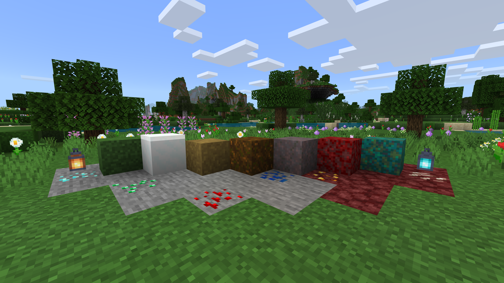
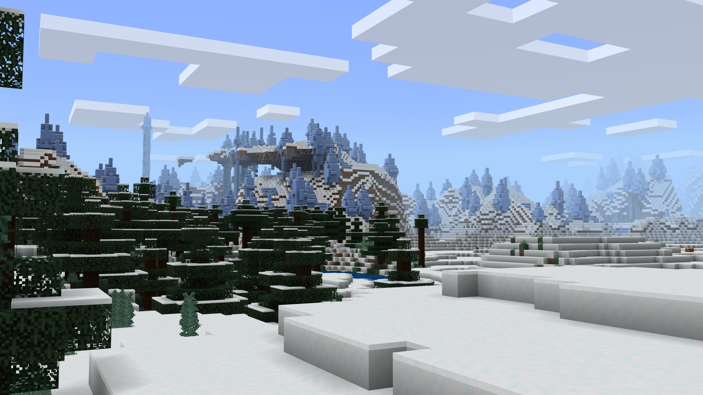
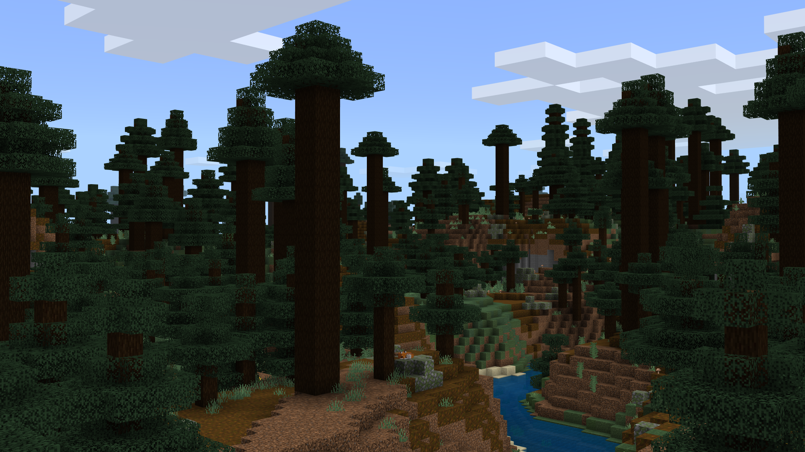
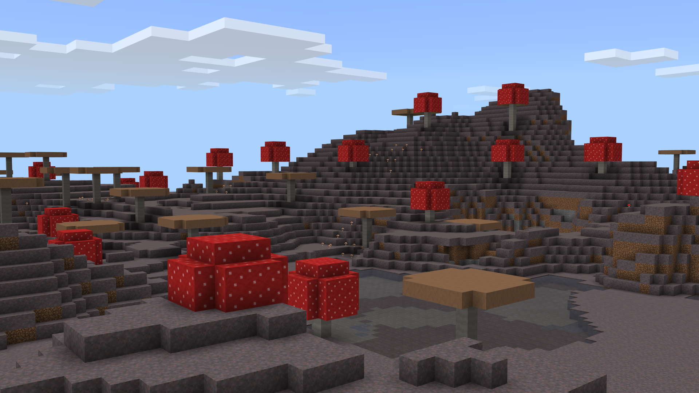

<table>
  <tr>
    <td>
      
    </td>
    <td>
      <h1>Simple Sides</h1>
    </td>
  </tr>
</table>

Simple Sides is a resource pack that streamlines the side textures of Grass, Snowy Grass, Grass Path, Podzol, Mycelium, Crimson Nylium, and Warped Nylium!

* Support for Bedrock Edition
* Support for Java Edition
* Designed to work in conjunction with all resource packs

You can share this resource pack, but please refer others to the official [MCPEDL post](https://mcpedl.com/simple-sides/), or this GitHub Repository only.

Feel free to include Simple Sides in your own resource pack! My only requests are for a mention of my username, "Offroaders123", and a link back to either this MCPEDL post, my MCPEDL profile, this GitHub Repository, or my GitHub profile. Thanks!

Found a bug? Have a feature suggestion? Feel free to [contact me by email](mailto:offroaders123@gmail.com), or submit a pull request to this GitHub Repository!

---

---

[Download for Bedrock Edition &#11015;](https://drive.google.com/drive/folders/1SRJwQsGecCwhXlnS-9Ee0FJIZ-kgvFqv)  
[Download for Java Edition &#11015;](https://drive.google.com/drive/folders/1LUQsPgm9KDIPfvG_r22B2djeyOQh6bcz)