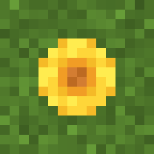
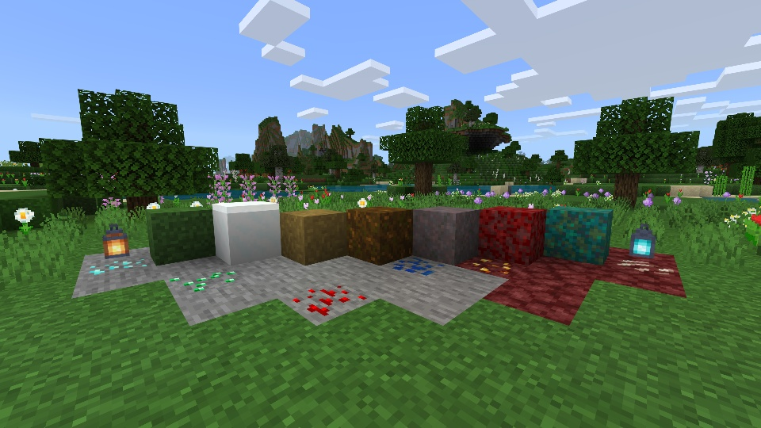
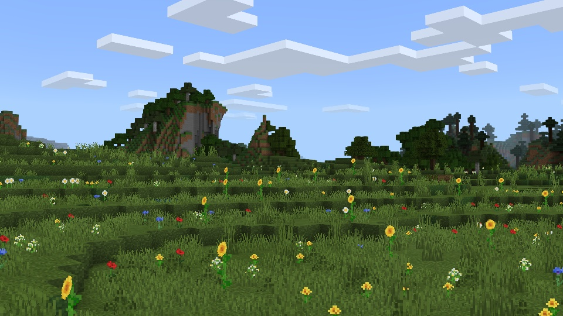
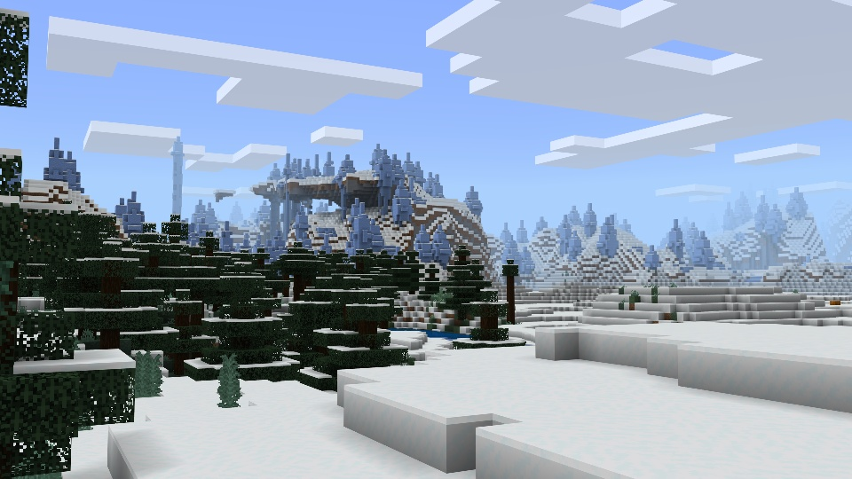
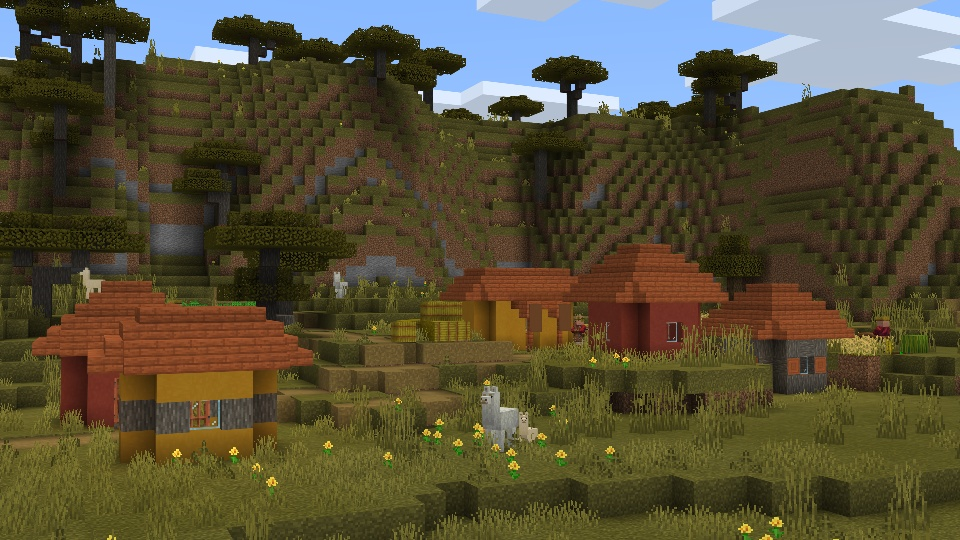
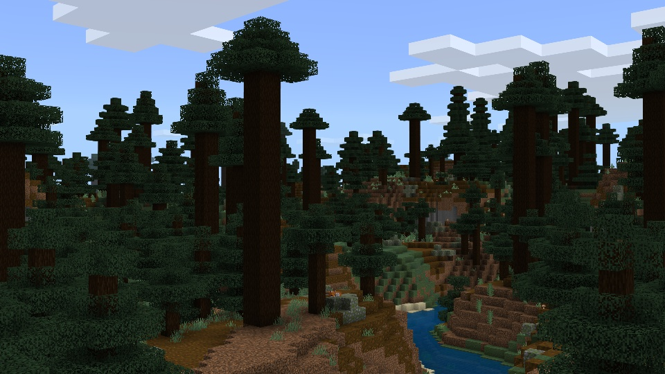

<table>
  <tr>
    <td>
      
    </td>
    <td>
      <h1>Simple Sides</h1>
    </td>
  </tr>
</table>

Simple Sides is a resource pack that streamlines the side textures of Grass, Snowy Grass, Grass Path, Podzol, Mycelium, Crimson Nylium, and Warped Nylium!

* Support for Bedrock Edition
* Support for Java Edition
* Designed to work in conjunction with all resource packs

You can share this resource pack, but please refer others to my website or MCPEDL only.

---

